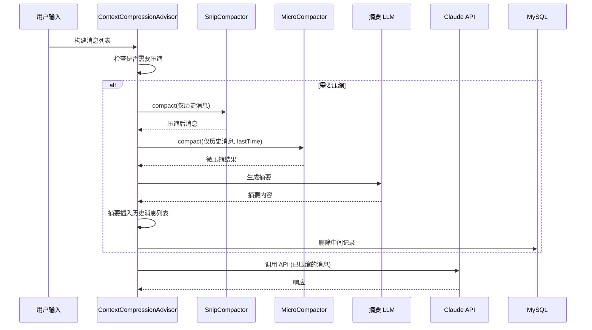
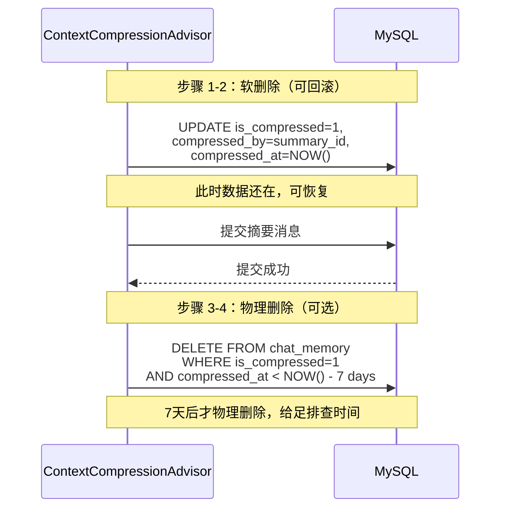
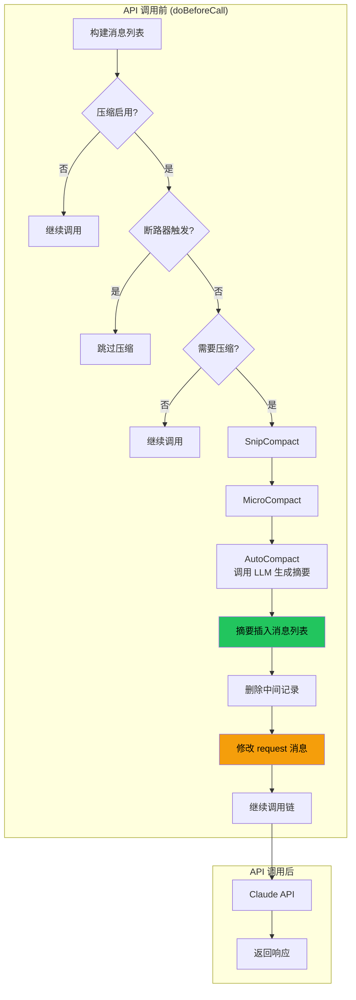
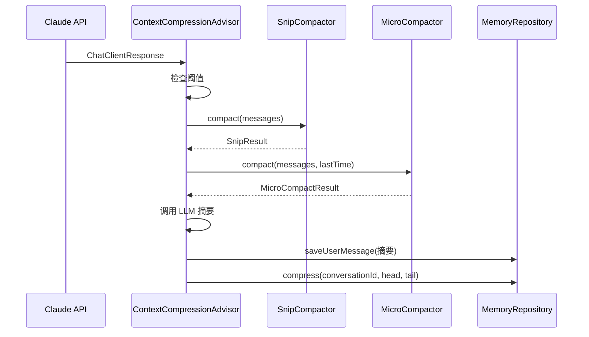

# ContextCompressionAdvisor 优化规格说明书

## 1. 概述

### 1.1 目标
优化 OmniAgent 的上下文压缩系统，参考 Claude Code 的四层压缩架构，提升压缩效率和上下文保留质量。

### 1.2 核心问题
1. 摘要仅存 VectorStore，未插入消息历史供后续 Prompt 使用
2. Token 估算不精确（简单 chars/4，误差 ±30%）
3. 无多层压缩策略
4. 无电路断路器保护
5. 摘要 Prompt 缺乏结构化要求
6. 工具输出截断破坏 JSON/XML 结构
7. 数据库物理删除无事务保护，Crash 会丢失数据

### 1.3 解决思路
- 压缩摘要 → **UserMessage** → 插入消息历史 → 随请求发送给 API
- 删除 VectorStore 存储

---

## 2. 架构设计

### 2.1 四层压缩流水线

**执行时机：每轮对话的 API 调用之前**

```
用户输入
    ↓
┌─────────────────────────────────────────────────────────┐
│ Layer 1: SnipCompact (无 API 调用)                        │
│   - 去重复、截断超长工具输出、删空消息                      │
│   - 立即生效，减少 token 消耗                            │
└─────────────────────────────────────────────────────────┘
    ↓
┌─────────────────────────────────────────────────────────┐
│ Layer 2: MicroCompact (无 API 调用)                        │
│   - 时间衰减触发：超过 gapThresholdMinutes 清理工具结果     │
│   - 保留最近 KEEP_RECENT 条工具结果                       │
└─────────────────────────────────────────────────────────┘
    ↓
┌─────────────────────────────────────────────────────────┐
│ Layer 3: AutoCompact (调用 API 生成摘要)                   │
│   - 检测到需要压缩时，先调用 LLM 生成摘要                    │
│   - 摘要插入消息历史                                      │
│   - 删除中间记录                                          │
│   - 然后才发送 API 请求 ← 关键！                          │
└─────────────────────────────────────────────────────────┘
    ↓
API 调用 (已压缩的消息)
    ↓
MySQL 消息历史
```

### 2.2 关键：压缩在 API 调用之前执行



### 2.3 消息分类与压缩范围

```
消息列表结构:
┌─────────────────────────────────────────────────────────────┐
│ [SystemMessage]          ← 系统提示，不压缩                  │
├─────────────────────────────────────────────────────────────┤
│ [UserMessage] OMNI_INJECTED  ← 工具注入，不压缩              │
├─────────────────────────────────────────────────────────────┤
│ [UserMessage] OMNI_INJECTED  ← 技能指南，不压缩              │
├─────────────────────────────────────────────────────────────┤
│ [UserMessage] OMNI_INJECTED  ← 动态上下文，不压缩           │
├─────────────────────────────────────────────────────────────┤
│ [UserMessage] OMNI_INJECTED  ← CWD 消息，不压缩              │
├─────────────────────────────────────────────────────────────┤
│ [History...] ← 从数据库加载的历史消息，参与压缩               │
├─────────────────────────────────────────────────────────────┤
│ [UserMessage]  ← 当前用户输入，不压缩                        │
└─────────────────────────────────────────────────────────────┘

压缩范围：仅 [History...] 部分
```

### 2.4 系统注入消息标记

```java
// 检测是否为系统注入消息
private boolean isInjectedMessage(Message msg) {
    Map<String, Object> metadata = msg.getMetadata();
    return metadata != null &&
           Boolean.TRUE.equals(metadata.get(AdvisorContextConstants.OMNI_INJECTED));
}

// 提取历史消息（用于压缩）
private List<Message> extractHistoryMessages(List<Message> messages) {
    return messages.stream()
            .filter(msg -> !isInjectedMessage(msg))
            .filter(msg -> msg instanceof UserMessage || msg instanceof AssistantMessage)
            .collect(Collectors.toList());
}
```

### 2.5 压缩后消息结构

```
压缩前 (历史部分):
[User1, Asst1, User2, Asst2, User3, Asst3, User4, Asst4]
     ↑                                            ↑
   历史开始                                   历史结束

API 调用前压缩:
[User1, Asst1, User(📋摘要), User3, Asst3, User4, Asst4]
              ↑
        摘要替换中间部分

最终消息列表:
[System] [Injected] [Injected] [Injected] [Injected] [压缩后的历史(含摘要)] [UserInput]
                    ↑          ↑          ↑          ↑              ↑                 ↑
                  保留       保留       保留       保留          已压缩            不压缩
```

---

## 3. 组件设计

### 3.1 CompressionResult

```java
@Data
public class CompressionResult {
    List<Message> messages;           // 压缩后的消息列表
    long preCompressionTokens;        // 压缩前 token 数
    long postCompressionTokens;       // 压缩后 token 数
    long freedTokens;                 // 释放的 token 数
    boolean compacted;                // 是否执行了压缩
    UserMessage summaryMessage;       // 摘要消息
    String summaryContent;            // 摘要内容
    boolean success;                 // 是否成功
    String failureReason;             // 失败原因
}
```

### 3.2 SnipCompactor

**功能**:
- 去除连续重复的 User/Assistant 消息
- 截断超长工具输出（**不破坏结构**，追加截断提示）
- 删除空内容消息

**截断安全设计**:
```java
private static final int MAX_TOOL_OUTPUT_LENGTH = 100;

/**
 * 截断工具输出，但不破坏结构
 * 追加截断提示，防止 LLM 产生幻觉
 */
private String truncateToolOutput(String content, int originalLength) {
    if (content == null || content.length() <= MAX_TOOL_OUTPUT_LENGTH) {
        return content;
    }

    String truncated = content.substring(0, MAX_TOOL_OUTPUT_LENGTH);
    return truncated + String.format(
        "\n\n[工具输出已截断，原长度 %d 字符]",
        originalLength
    );
}
```

**示例**:
```
# 截断前
{"result": "very long content...", "status": "ok", "data": [...]}

# 截断后
{"result": "very long content...",

[工具输出已截断，原长度 2345 字符]
```

**接口**:
```java
public class SnipCompactor {
    public SnipResult compact(List<Message> messages);
}

public record SnipResult(List<Message> messages, long tokensFreed) {}
```

### 3.3 MicroCompactor

**功能**:
- 时间衰减触发：距离上次 Assistant 消息超过 `gapThresholdMinutes`（默认 60 分钟）时触发
- 清除旧工具结果，仅保留最近 `keepRecent`（默认 5）条

**重要**：只压缩**历史消息**，系统注入消息不参与压缩

**接口**:
```java
public class MicroCompactor {
    public MicroCompactResult compact(List<Message> messages, String conversationId);
    public MicroCompactResult compact(List<Message> messages, Timestamp lastAssistantTime);
}

public class MicroCompactResult {
    List<Message> messages;
    boolean compacted;
    long freedTokens;
    int clearedCount;
}
```

### 3.4 Token 估算（精确实现）

**问题**: 简单 `chars / 4` 在多语言环境下误差极大（±30%）。

**解决方案**: 引入精确的 Tokenizer 库

#### 3.4.1 依赖

```xml
<!-- OpenAI / MiniMax 等兼容 OpenAI tokenizer 的模型 -->
<dependency>
    <groupId>com.knuddels</groupId>
    <artifactId>jtokkit</artifactId>
    <version>0.4.0</version>
</dependency>
```

#### 3.4.2 实现

```java
import com.knuddels.jtokkit.api.Model;
import com.knuddels.jtokkit.api.Tokenizer;
import com.knuddels.jtokkit.api.TokenizerRegistry;

/**
 * 精确 Token 计数
 * 使用 JTokkit 的 BPE 算法
 */
public class TokenEstimator {

    private static final TokenizerRegistry registry = TokenizerRegistry.ofDefault();
    private static final Tokenizer tokenizer = registry.getTokenizer(Model.GPT_4_O);

    public static int estimateTokens(String text) {
        if (text == null || text.isEmpty()) {
            return 0;
        }
        return tokenizer.encode(text).getTokens().size();
    }

    public static long estimateMessages(List<Message> messages) {
        long total = 0;
        for (Message msg : messages) {
            total += estimateTokens(msg.getText());
        }
        return total;
    }
}
```

#### 3.4.3 精度对比

| 方法 | 中文误差 | 英文误差 |
|-----|---------|---------|
| `chars / 2` | 偏少 ~20% | 偏少 ~25% |
| `chars * 0.75` | 偏多 ~15% | 准确 |
| **JTokkit BPE** | **<5%** | **<2%** |

### 3.5 ContextCompressionAdvisor

**职责**:
- 多层压缩编排
- 电路断路器管理
- 摘要插入历史

**核心方法**:
```java
@Override
protected ChatClientRequest doBeforeCall(
        ChatClientRequest request,
        CallAdvisorChain chain) {

    // 1. 构建当前消息列表
    List<Message> allMessages = buildCurrentMessages(request);

    // 2. 提取历史消息（排除系统注入）
    List<Message> historyMessages = extractHistoryMessages(allMessages);

    // 3. 找到历史消息在列表中的位置
    int historyStartIndex = findHistoryStartIndex(allMessages);

    // 4. 检查是否需要压缩（仅对历史消息）
    if (isCompressionRequired(historyMessages)) {
        // 5. 执行压缩（API 调用之前）
        CompressionResult result = executeCompression(historyMessages);

        if (result.isCompacted()) {
            // 6. 重组消息列表：系统注入 + 压缩后的历史 + 用户输入
            List<Message> compressedMessages = rebuildMessages(
                    allMessages, historyStartIndex, result.getMessages());
            // 7. 修改 request
            request = modifyRequestMessages(request, compressedMessages);
        }
    }

    // 继续调用链
    return chain.nextCall(request);
}
```

---

## 4. 配置项

### 4.1 ContextCompressionProperties

| 配置项 | 默认值 | 说明 |
|-------|-------|------|
| `enabled` | true | 是否启用压缩 |
| `contextWindow` | 200000 | 上下文窗口大小 |
| `threshold` | 0.8 | 压缩触发阈值 (80%) |
| `keepRecent` | 2 | 保留尾部消息轮数 |
| `keepEarliest` | 1 | 保留头部消息轮数 |
| `snipEnabled` | true | 启用 SnipCompact |
| `microCompactEnabled` | true | 启用 MicroCompact |
| `gapThresholdMinutes` | 60 | 时间衰减阈值 (分钟) |
| `microCompactKeepRecent` | 5 | MicroCompact 保留数 |
| `autoCompactEnabled` | true | 启用 AutoCompact |
| `maxSummaryTokens` | 2000 | 摘要最大 token |
| `maxConsecutiveFailures` | 3 | 断路器阈值 |
| `circuitBreakerEnabled` | true | 启用断路器 |

---

## 5. 摘要 Prompt 设计

### 5.1 System Prompt

```
你是一个上下文压缩引擎。你的任务是将长对话压缩成简洁、事实性的摘要。

# 压缩要求
1. **合并 (MERGE)**: 将新进展无缝整合到现有摘要中
2. **保留 (RETAIN)**: 保留精确的文件路径、命令、代码决策
3. **剪枝 (PRUNE)**: 删除已完成的过时步骤
4. **格式 (FORMAT)**: 使用密集的 Markdown 要点格式

# 约束
- 禁止调用任何工具
- 仅输出原始摘要内容
- 使用 <analysis> 和 <summary> 标签包裹
```

### 5.2 摘要格式 (9 段式)

```markdown
<summary>
1. **主要请求和意图**: [详细描述]
2. **关键技术概念**: [列表]
3. **文件和代码段**: [文件列表 + 摘要]
4. **错误和修复**: [错误描述 + 解决方法]
5. **问题解决**: [已解决 + 进行中]
6. **所有用户消息**: [消息列表]
7. **待处理任务**: [任务列表]
8. **当前工作**: [描述]
9. **可选的下一步**: [下一步]
</summary>
```

### 5.3 摘要消息格式

```java
private String buildSummaryMessage(String summary) {
    return String.format("""
            [上下文压缩摘要]

            %s

            继续对话，不要询问用户。
            """, formatted);
}
```

---

## 6. 电路断路器

### 6.1 状态机

```
        ┌─────────────┐
        │   正常      │
        └──────┬──────┘
               │
               ▼
        ┌─────────────┐
        │ 连续失败 N 次│ ──→ 触发断路器
        └──────┬──────┘
               │
               ▼
        ┌─────────────┐
        │ 暂停自动压缩 │
        └─────────────┘
```

### 6.2 规则
- 连续失败 >= `maxConsecutiveFailures`（默认 3）时触发
- 成功后重置计数器
- 触发后暂停自动压缩，需手动或重启恢复

---

## 7. 文件变更

### 7.1 新建

| 文件 | 说明 |
|-----|------|
| `CompressionResult.java` | 压缩结果记录 |
| `SnipCompactor.java` | SnipCompact 实现 |
| `MicroCompactor.java` | MicroCompact 实现 |
| `TokenEstimator.java` | 精确 Token 计数（JTokkit BPE） |

### 7.2 修改

| 文件 | 变更 |
|-----|------|
| `ContextCompressionProperties.java` | 新增配置项 |
| `ContextCompressionAdvisor.java` | 重构为多层压缩编排 |
| `MemoryRepository.java` | 新增软删除方法 |

### 7.3 删除

| 依赖 | 说明 |
|-----|------|
| VectorStore | 不再存储摘要到向量数据库 |

### 7.4 数据库一致性设计（软删除）

**问题**: 物理删除中间记录后，如果进程 Crash，**数据会丢失且无法恢复**。

**解决方案**: 使用**软删除 + 事务**

#### 7.4.1 数据库表变更

```sql
ALTER TABLE chat_memory ADD COLUMN is_compressed TINYINT(1) DEFAULT 0;
ALTER TABLE chat_memory ADD COLUMN compressed_by VARCHAR(64) DEFAULT NULL;
ALTER TABLE chat_memory ADD COLUMN compressed_at TIMESTAMP NULL;
```

#### 7.4.2 压缩事务流程



#### 7.4.3 软删除实现

```java
/**
 * 软删除中间记录（不丢失原始数据）
 */
public void softDeleteIntermediateRecords(String conversationId, int keepHead, int keepTail) {
    // 1. 找出要软删除的记录
    String sql = """
        UPDATE chat_memory
        SET is_compressed = 1,
            compressed_by = ?,
            compressed_at = NOW()
        WHERE conversation_id = ?
        AND id NOT IN (
            SELECT id FROM (
                SELECT id FROM chat_memory
                WHERE conversation_id = ?
                ORDER BY id ASC LIMIT ?
            ) h
            UNION
            SELECT id FROM (
                SELECT id FROM chat_memory
                WHERE conversation_id = ?
                ORDER BY id DESC LIMIT ?
            ) t
        )
        AND is_compressed = 0
        """;
    jdbcTemplate.update(sql, summaryId, conversationId,
            conversationId, keepHead, conversationId, keepTail);
}

/**
 * 可选：定期物理删除 7 天前的压缩记录
 */
public void purgeCompressedRecords(int daysOld) {
    String sql = "DELETE FROM chat_memory WHERE is_compressed = 1 AND compressed_at < DATE_SUB(NOW(), INTERVAL ? DAY)";
    jdbcTemplate.update(sql, daysOld);
}
```

#### 7.4.4 故障恢复

```
如果进程在压缩过程中 Crash：
1. MySQL 中的记录 is_compressed=1，但 compressed_by 可能没有对应的摘要
2. 恢复时查询 is_compressed=1 的记录，还原为未压缩状态
3. 重新执行压缩流程
```

---

## 8. 流程图

### 8.1 压缩流程（API 调用前）



### 8.2 消息流



---

## 9. 配置示例

```yaml
spring:
  ai:
    context:
      compression:
        enabled: true
        context-window: 200000
        threshold: 0.8
        keep-recent: 2
        keep-earliest: 1

        # SnipCompact
        snip-enabled: true

        # MicroCompact
        micro-compact-enabled: true
        gap-threshold-minutes: 60
        micro-compact-keep-recent: 5

        # AutoCompact
        auto-compact-enabled: true
        max-summary-tokens: 2000

        # Circuit Breaker
        circuit-breaker-enabled: true
        max-consecutive-failures: 3
```

---

## 10. 验收标准

### 10.1 功能验收
- [ ] 压缩在 API 调用之前执行（doBeforeCall）
- [ ] 压缩后的摘要作为 UserMessage 正确插入消息历史
- [ ] 当前 API 调用使用已压缩的消息（享受压缩效果）
- [ ] 不再向 VectorStore 存储摘要
- [ ] SnipCompact 截断工具输出后追加截断提示，不破坏结构
- [ ] MicroCompact 时间衰减触发正确
- [ ] 电路断路器在连续失败后正确触发
- [ ] 压缩后上下文保持完整性
- [ ] 使用软删除（is_compressed=1）而非物理删除
- [ ] 进程 Crash 后数据可恢复

### 10.2 性能验收
- [ ] 使用 JTokkit BPE 精确估算 Token（误差 <5%）
- [ ] Token 估算误差在可接受范围（<10%）
- [ ] 压缩不影响主流响应延迟

### 10.3 配置验收
- [ ] 所有配置项可通过 yaml 配置
- [ ] 默认值合理
